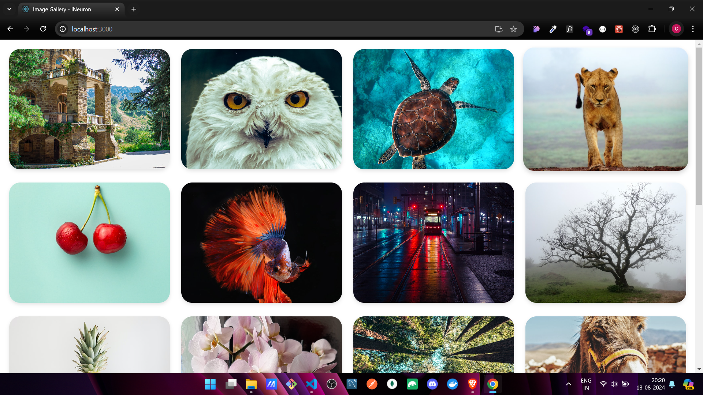
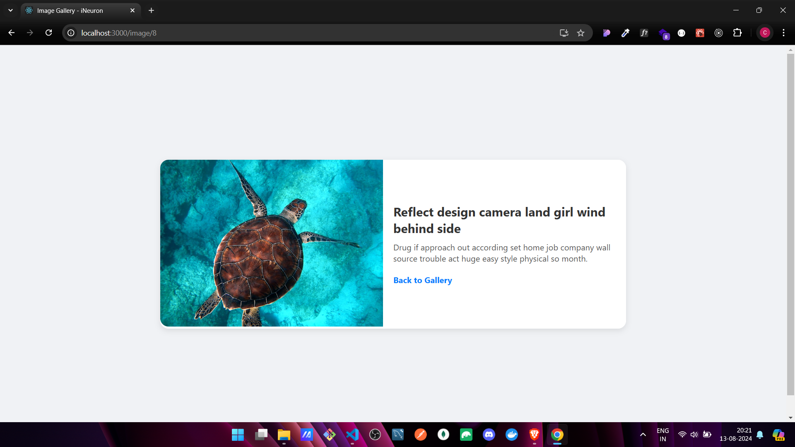

# 🎨 React Image Gallery

 

## 🖼️ Introduction

Welcome to the **React Image Gallery**! This project showcases an elegant image gallery that fetches and displays images from an API. The images are presented in a user-friendly grid layout, and you can click on any image to view it in detail.

## ✨ Features

- 🚀 **Responsive Image Gallery**: A grid of 12 images, beautifully arranged in 4 columns and 3 rows.
- 🖱️ **Interactive Single Image View**: Click on any image to see it enlarged with a title and description.
- 🎨 **Smooth Hover Effects**: Enjoy subtle animations and effects when interacting with the gallery.
- 🔀 **Easy Navigation**: Seamless transitions between the gallery and single image view using React Router.
- ❗ **Error Handling**: Gracefully manages API failures or empty results.

## 📁 Project Structure

```bash
react-image-gallery/
│
├── public/
│   ├── index.html
│   └── ...
│
├── src/
│   ├── components/
│   │   ├── Gallery.js        # Main gallery component
│   │   ├── SingleImage.js    # Single image view component
│   │   └── ...
│   ├── styles/
│   │   ├── Gallery.css       # Styles for the gallery
│   │   ├── SingleImage.css   # Styles for the single image view
│   │   └── ...
│   ├── App.js                # Main app component
│   ├── index.js              # Entry point
│   └── ...
│
├── package.json
├── README.md
└── ...
```

## 🛠️ Technologies Used

- ⚛️ **React**: A powerful JavaScript library for building user interfaces.
- 🌐 **React Router**: For managing navigation between different views.
- 📡 **Axios**: To fetch images from the API.
- 🎨 **CSS**: Custom styling for layout and hover effects.

---

### 📷 Screenshot

🔗 [Live Demo Link](https://image-gallery-react-chaicode.netlify.app/)





---

## 🚀 Getting Started

### 📋 Prerequisites

Make sure you have Node.js and npm (or Yarn) installed on your machine.

### 📦 Installation

1. **Clone the repository**:

   ```bash
   git clone https://github.com/ChinmayKaitade/Image-Gallery-React.git
   cd react-image-gallery
   ```

2. **Install dependencies**:

   ```bash
   npm install
   ```

   or

   ```bash
   yarn install
   ```

### ▶️ Running the Application

1. **Start the development server**:

   ```bash
   npm start
   ```

   or

   ```bash
   yarn start
   ```

2. **Open the application**:

   Open your browser and navigate to `http://localhost:3000` to view the app.

## 🌐 API

The images are fetched from the following API:

[https://api.slingacademy.com/v1/sample-data/photos?offset=5&limit=20](https://api.slingacademy.com/v1/sample-data/photos?offset=5&limit=20)

## 🚢 Deployment

To create a production-ready build:

```bash
npm run build
```

or

```bash
yarn build
```

Deploy the contents of the `build` directory to your preferred hosting service.

## 🤝 Contributing

Contributions are welcome! Please fork this repository, make your changes, and submit a pull request. 🙌

## 📄 License

This project is licensed under the MIT License - see the [LICENSE](LICENSE) file for details.

## 📩 Lets Connect

<a href="https://www.linkedin.com/in/chinmay-sharad-kaitade/" target="blank"></a> | <a href="https://www.instagram.com/chinmaykaitade_hunter/" target="blank"></a> | <a href="https://x.com/chinmaydotcom" target="blank"></a>

---
