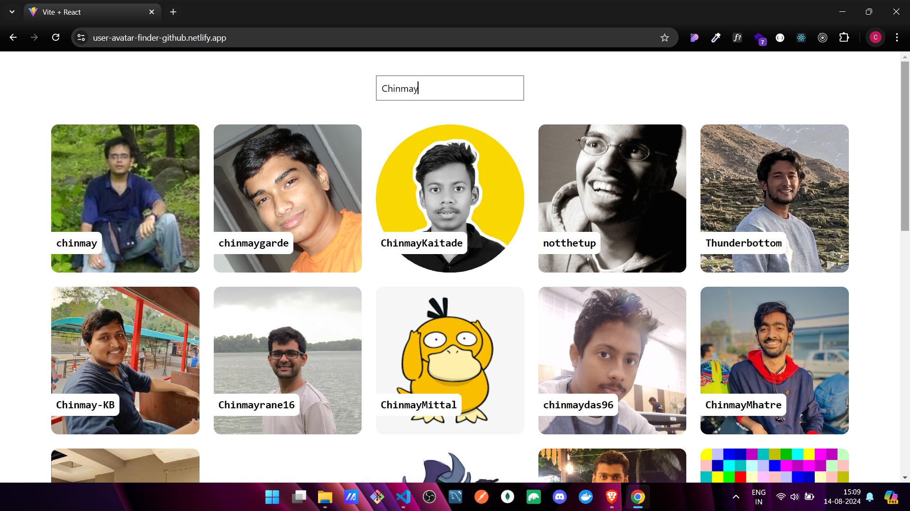
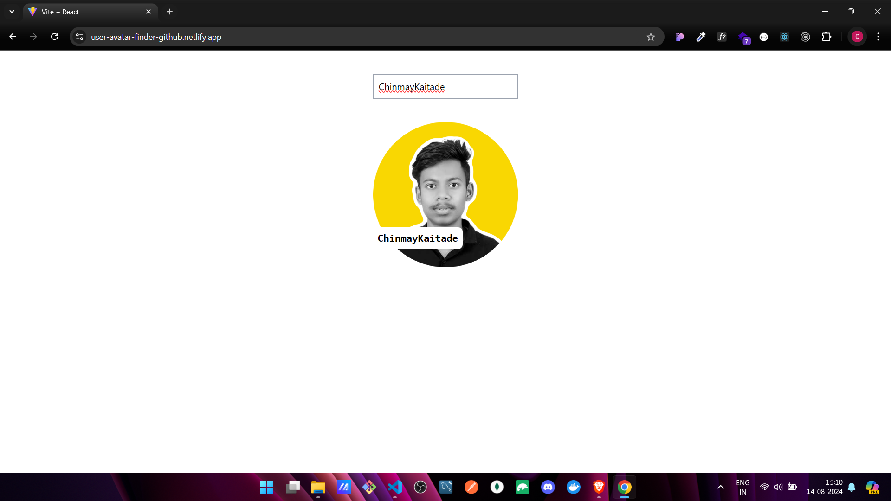

# 🚀 GitHub Avatar Finder


A simple and elegant React application to find and display GitHub user avatars by their username. This project demonstrates the integration of GitHub's API, debouncing with custom hooks, and a user-friendly interface.

## 📋 Features

- 🔍 **User Search**: Search for any GitHub user by their username.
- 🖼️ **Avatar Display**: Display the user's GitHub avatar in a stylish, rounded frame.
- 🛠️ **Debouncing**: Prevent excessive API calls with a custom debouncing hook.
- ❌ **Error Handling**: User-friendly error messages for invalid usernames or failed requests.
- 🎨 **Responsive Design**: Mobile-first design ensures a great experience on any device.

### 📷 Screenshot

🔗 [Live Demo Link](https://user-avatar-finder-github.netlify.app/)





## 🌟 Future Scope

- 🗃️ **User Details**: Display additional user information like bio, number of repositories, followers, etc.
- 🌐 **Dark Mode**: Add a toggle to switch between light and dark themes.
- 💾 **Favorites**: Allow users to save their favorite GitHub profiles.
- 🔄 **Autocomplete**: Implement username suggestions as the user types.

## 🛠️ Project Structure

````bash
dist/
├── index.html             # Main HTML file, entry point for the app
├── logo192.png            # Web app logo (small size)
├── manifest.json          # Web app manifest for PWA settings
├── robots.txt             # Instructions for search engine bots
├── vite.svg               # Vite logo, possibly used in the app

src/
├── components/
│   ├── GitHubCard/        # Components related to GitHub profile cards
│   ├── Home/              # Home page component
│   └── InputBox/          # Components for input handling
├── hooks/
│   └── useDebounce.js     # Custom hook to debounce input values
├── routes/
│   └── CustomRoutes.jsx   # Custom routing configuration
├── App.js                 # Main app component
├── App.css                # Global CSS for the app
├── index.js               # Entry point for React, renders the app
├── main.jsx               # Main JavaScript file for the app
├── tailwind.config.js     # Tailwind CSS configuration
└── vite.config.js         # Vite configuration file

.gitignore                  # Specifies files and directories to ignore in Git
package.json                # Project dependencies and scripts
README.md                   # Project documentation and instructions
```


## 🚀 Getting Started

### Prerequisites

- Node.js and npm installed on your machine.
- Basic understanding of React.

### Installation

1. **Clone the repository**:

   ```bash
   git clone https://github.com/ChinmayKaitade/github-user-avatar-finder.git
````

2. **Install dependencies**:

   ```bash
   npm install
   ```

3. **Run the application**:

   ```bash
   npm start
   ```

   The application should now be running on `http://localhost:3000`.

## 🤖 Usage

1. Enter a GitHub username in the input box.
2. The avatar will be displayed below after a short delay.
3. If the username doesn't exist, an error message will be shown.

## 🤝 Contributing

Contributions are welcome! Please fork this repository, make your changes, and submit a pull request. 🙌

### Steps to Contribute:

1. **Fork the repository**.
2. **Create a new branch** (`git checkout -b feature-branch`).
3. **Commit your changes** (`git commit -am 'Add new feature'`).
4. **Push to the branch** (`git push origin feature-branch`).
5. **Create a Pull Request**.

## 📄 License

This project is licensed under the MIT License - see the [LICENSE](LICENSE) file for details.

## 📩 Lets Connect

<a href="https://www.linkedin.com/in/chinmay-sharad-kaitade/" target="blank"></a> | <a href="https://www.instagram.com/chinmaykaitade_hunter/" target="blank"></a> | <a href="https://x.com/chinmaydotcom" target="blank"></a>

---

<p align="center">
Made with ❤️ by <a href="https://github.com/ChinmayKaitade">Chinmay Kaitade</a>
</p>
