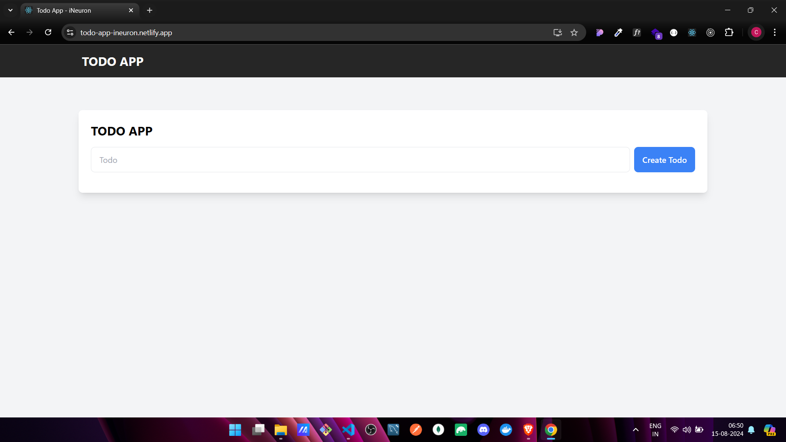
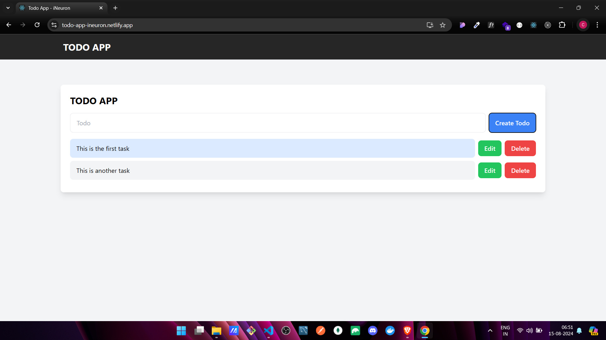

# 📋 TODO App


Welcome to the **TODO App** – a simple, elegant, and effective task management tool to help you stay organized and productive! 🚀

## ✨ Features

- 📝 **Create Todos**: Add new tasks quickly and easily.
- ✏️ **Edit Todos**: Modify your tasks on the go.
- 🗑️ **Delete Todos**: Remove tasks that are no longer needed.
- 🔍 **Search Todos**: Find specific tasks with ease.
- ✅ **Mark as Complete**: Check off tasks you've completed.
- ⚡ **Priority Levels**: Categorize your tasks as Low, Medium, or High priority.
- 🕒 **Sort Tasks**: Sort tasks by creation time or priority.

## 🛠️ Tech Stack

- **React.js**: A JavaScript library for building user interfaces.
- **Tailwind CSS**: A utility-first CSS framework for styling.
- **Daisy UI**: A component library for Tailwind CSS that enhances UI components.
- **LocalStorage**: To persist data between sessions.

## 📷 Screenshot

🔗 [Live Demo Link](https://todo-app-ineuron.netlify.app/)





## 📂 Project Structure

```plaintext
todo-app/
├── public/              # Public directory for static files
│   ├── index.html       # HTML template
│   └── ...              # Other assets (favicon, manifest, etc.)
├── src/                 # Source directory
│   ├── components/      # React components
│   ├── App.js           # Main App component
│   ├── index.js         # Entry point for React
│   └── ...              # Other source files
├── tailwind.config.js   # Tailwind CSS configuration
├── package.json         # Project metadata and dependencies
└── README.md            # Project documentation
```

## 🚀 How to Use

1. **Clone the repository**:

   ```bash
   git clone https://github.com/ChinmayKaitade/Todo-React-App.git
   ```

2. **Install dependencies**:

   ```bash
   npm install
   ```

3. **Start the development server**:

   ```bash
   npm start
   ```

4. **Open the app**:
   Open your browser and go to `http://localhost:3000` to see your Todo App in action!

## 🔮 Future Scope

- **User Authentication**: Add login and signup functionality.
- **Due Dates**: Allow users to set due dates for tasks.
- **Reminders**: Notify users of upcoming tasks.
- **Subtasks**: Break down larger tasks into smaller, manageable subtasks.
- **Collaborative Todos**: Allow multiple users to collaborate on the same task list.

## 🤝 Contributing

Contributions are welcome! Please fork this repository, make your changes, and submit a pull request. 🙌

1. **Fork the project**
2. **Create a new branch** (`git checkout -b feature/AmazingFeature`)
3. **Commit your changes** (`git commit -m 'Add some AmazingFeature'`)
4. **Push to the branch** (`git push origin feature/AmazingFeature`)
5. **Open a pull request**

## 📄 License

This project is licensed under the MIT License - see the [LICENSE](LICENSE) file for details.

## 📩 Lets Connect

<a href="https://www.linkedin.com/in/chinmay-sharad-kaitade/" target="blank"></a> | <a href="https://www.instagram.com/chinmaykaitade_hunter/" target="blank"></a> | <a href="https://x.com/chinmaydotcom" target="blank"></a>

---

<p align="center">
Made with ❤️ by <a href="https://github.com/ChinmayKaitade">Chinmay Kaitade</a>
</p>
