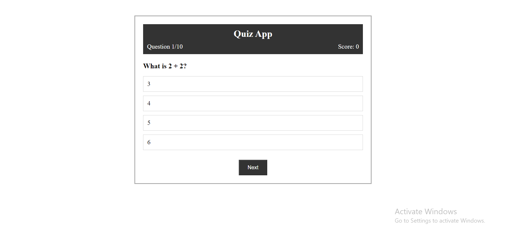

# Quiz App

Welcome to the **Quiz App** Project. In this project user has to create a simple quiz application, where one can test his skills.

## 🌟Features

- Button to start the quiz.
- User can see that the attended questions answer is correct or not.
- User can see his score card.
- User can restart the game after completion.

## 🛠️Tech Stack Used

- HTML
- CSS
- JavaScript

## 🚀Getting Started

1. Clone this repository:

```
git clone https://github.com/ChinmayKaitade/Quiz-App-iNeuron
```

2. Now run the project with Live Server to get the desired Output.

## Output



## 💼Contribution

Contribution are always welcomed. Feel free to raise issues or send in pull requests. If have any queries or suggestions mail me on: [chinmaykaitade123@gmail.com](mailto:chinmaykaitade123@gmail.com)


---

Happy Learning!✨🔥👨‍💻

---

**_Made with_ 🍵 _by ChinmayKaitade_**
